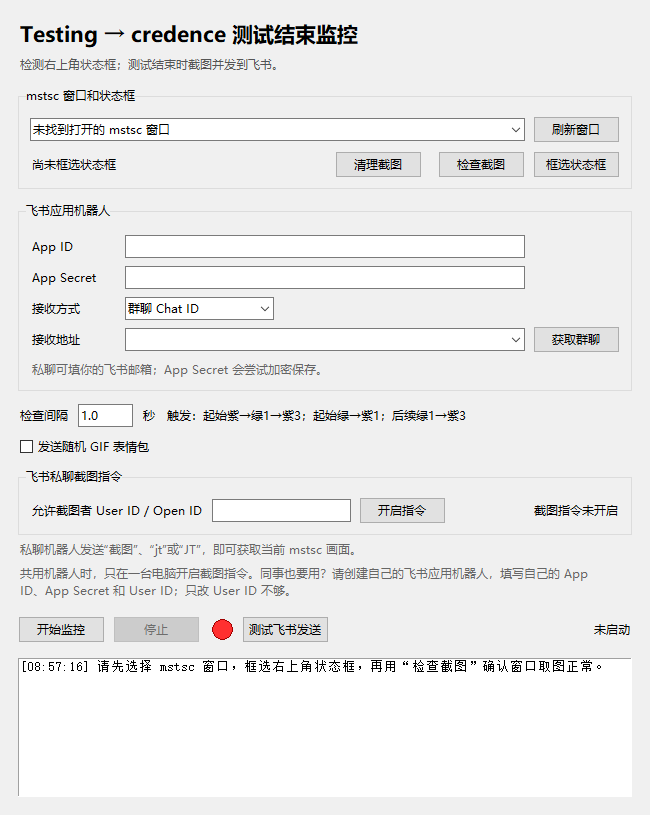

# MSTSC 测试结束监控

> Windows 桌面工具：监控远程桌面里的 Testing / credence 状态变化，自动截图并通过飞书机器人提醒。



适用于远程测试程序右上角状态框由绿色 **Testing** 变为紫色 **credence** 的场景。可以在 mstsc 窗口被其他窗口遮挡时取图，但请先用“检查截图”确认你的 Windows 环境确实能捕获实时画面。支持飞书私聊和群聊、私聊发送 `截图` / `jt` / `JT` 获取当前远程画面、异常提醒、发送失败自动补发和可选的随机 GIF。

## 快速部署

本项目只支持 Windows。想直接使用时，到 [Releases](https://github.com/Dengjiancong/mstsc_monitor/releases/latest) 下载 `MSTSC_Monitor.exe`，单独放进一个文件夹后双击运行，不需要安装 Python。首次启动请在程序内填写自己的飞书应用信息，选择 mstsc 窗口并框选状态框；个人配置、截图和可选 GIF 会保存在 exe 所在文件夹。

想从源码运行时，获取项目文件并在项目目录执行：

```powershell
py -3 -m pip install -r requirements.txt
py -3 completion_monitor.py
```

也可以直接双击 `安装飞书指令依赖.bat`，再双击 `启动监控.bat`。这些脚本要求 `python` / `pythonw` 已在 PATH 中。若想自己生成单文件程序，双击 `一键打包EXE.bat`；脚本会安装 `build-requirements.txt` 中的构建依赖，并在项目目录生成 `MSTSC_Monitor.exe`。生成的 exe 已包含飞书长连接依赖，使用者不需要再运行依赖安装脚本。打包前请先关闭旧 exe。第三方依赖来自 PyPI，首次安装与打包需要网络。

首次启动需要在程序内填写自己的飞书应用信息，选择 mstsc 窗口并框选状态框。`completion_config.json` 由程序在运行时生成，**不在仓库中**；截图、待补发记录以及个人 GIF 也不在仓库中。

这个 Windows 程序监控 mstsc 窗口中右上角的状态框。触发规则分三种：**启动时若已是紫色 credence**，先等待检测到一次绿色 Testing，再连续检测三次紫色后截图提醒；**启动时若是绿色 Testing**，首次检测到紫色就截图提醒；**提醒过之后**，同一段紫色不会重复发送，下一轮仍需要一次绿色、连续三次紫色才再次提醒。触发时按顺序发送完整 mstsc 截图、**截图时的时间**（例如 `2026年9月16日 08:24:52`）、温柔清楚的结束文字；开启“发送随机 GIF 表情包”时，最后从同目录 `gif` 文件夹随机选一个 GIF 发送。时间取触发截图时，而不是飞书补发时；截图文件名也使用同一时刻。提醒只说明**测试结束**，不判断结果通过或失败。飞书发送在后台依次进行，监控检测会持续运行，不会在发送期间暂停。

六组温柔提醒语句写在 `completion_messages.py` 的 `MESSAGES = (...)` 中。要添加自己的话，在括号里增加一行带英文引号的文字，行尾加英文逗号，例如 `"测试已结束，截图已经送到你手边。",`。保存文件后**关闭并重新启动监控程序**，新语句就会参与轮流发送。

## 启动与选区

1. 有打包好的 `MSTSC_Monitor.exe` 时直接双击 exe，无需安装 Python；使用源码时，安装 Python 3（安装时勾选“Add python.exe to PATH”），双击 `启动监控.bat`。
2. 打开 mstsc，点击程序里的“刷新窗口”，选择目标 mstsc 窗口。
3. 让 mstsc 画面可见，点击“框选状态框”，框住**右上角**绿色 Testing / 紫色 credence 区域，尽量不要选到左侧大横条或下方结果区。
4. 点击“检查截图”。程序会打开刚保存的截图。此时监控程序本身已遮挡 mstsc；确认截图仍显示**真实的远程画面**，而不是黑图、旧画面或监控程序窗口。截图保存在 `screenshots` 文件夹。
5. 配好飞书后先点击“测试飞书发送”，确认私聊或群里收到测试截图和“监控通知测试”；开启表情包时，还会收到随机 GIF。再点击“开始监控”；“停止”右侧的指示灯在正常取图时为亮绿色，出现取图失败、截图暂时无法保存、长期无法识别画面或监控停滞时为黄色，未监控或由你手动停止后为亮红色。电脑保持开机，mstsc 保持打开且不要最小化。

程序通过 Windows `PrintWindow` 请求 mstsc 绘制窗口画面，这比直接读取屏幕颜色更适合窗口被遮挡的情况。不过不同 mstsc 版本、显卡和远程图像渲染方式可能不返回可用画面，必须通过“检查截图”验证。若截图错误，请不要依赖监控结果。

单文件 exe 会在**自身所在的文件夹**读取和保存 `completion_config.json`，并在该文件夹使用 `gif` 和 `screenshots` 子文件夹。把 exe 复制到另一个目录后，需要在新目录重新配置飞书和选区；个人使用时也可以把 exe 放在原监控项目文件夹，与现有配置和 GIF 共用。请不要把包含 App Secret 的个人配置文件一起放进公开项目或分享包。以后双击源码目录的 `一键打包EXE.bat` 即可重新打包；脚本会把同目录的 `sikadi.ico` 同时用于 exe 文件和运行窗口的图标，在**同目录**生成 `MSTSC_Monitor.exe`。重新打包前请先关闭正在运行的旧 exe。

## 监控异常提醒与清理截图

- 取图或颜色识别失败后亮黄灯并持续重试；**连续 3 次失败**时提示音并向飞书提醒一次，之后仍保持监控、不重复提醒。恢复正常取图后变回绿灯，再发生新的一轮连续失败才会再次提醒。mstsc 最小化后重新展开同一窗口可自行恢复；若窗口已关闭又重新打开，通常会换成新的窗口编号，需要你手动停止、重新选择窗口后再开始监控。程序不会因为连续取图失败自动点击“停止”。
- 状态框连续至少 **30 秒**无法识别为绿色 Testing 或紫色 credence：亮黄灯、提示音并向飞书发送一次提醒，监控继续运行；画面恢复正常后会重新计时并变回绿灯。画面仍能识别颜色但实际上已经冻结时，程序不能可靠地发现冻结。
- 若监控线程长时间没有完成取图（超过约 `检查间隔 × 3 + 5 秒`，且至少 8 秒），或线程意外退出：亮黄灯、提示音，并向飞书发送一次异常提醒。取图重新正常完成后变回绿灯；线程意外退出时需要手动重新开始监控。看门狗能发现取图卡住，但无法强制中断已经卡在 Windows 截图调用里的线程，需要检查远程连接并重启程序。
- 若测试结束时暂时无法保存截图或加入待发队列，程序亮黄灯并提醒，但继续监控；先在内存中保留最多 **3 张**结束画面，每次成功取图时再次尝试保存，成功后恢复绿灯并发送。若超过 3 张仍无法保存，后续结束画面可能漏存，程序会再提醒一次。关闭程序会丢失尚未写入磁盘的画面，应先解决磁盘故障。
- 测试结束截图、截图时间、结束文字，以及监控异常文字提醒会记录在 exe 同目录的 `pending_notifications` 文件夹。网络暂时不可用时自动延时重试；关闭程序后再打开，也会继续补发。每条测试结束提醒的图片、时间、结束文字分别记录发送进度，已确认发出的内容不会因为下一条失败而整套重发；飞书消息使用固定 `uuid` 降低请求超时后的重复风险。自动补发需要原应用的 App ID 和可解密的 App Secret 配置，截图也要保留在原 `screenshots` 文件夹。GIF 表情包仍是附加发送，不参与补发。网络持续故障时，黄色/红色指示灯和本机日志、提示音仍可提示异常，但飞书消息会等连接恢复才送达。
- “清理截图”按钮位于窗口和状态框区域。先手动停止监控，等待截图、发送及待补发截图任务都完成；点击按钮后确认，才会删除 `screenshots` 文件夹里程序生成的 `completion_*.png` 图片。其他文件和 `gif` 文件夹不受影响。删除后无法恢复，程序不会自动清理。

## 飞书配置

需要**飞书企业自建应用机器人**，仅有群自定义机器人的 Webhook 不足以把本地 PNG 文件直接上传并发送。

1. 在[飞书开放平台](https://open.feishu.cn/)创建企业自建应用，启用机器人能力。
2. 开通“获取与发送单聊、群组消息”（`im:message`）等发送消息所需权限；若要用程序的“获取群聊”按钮，也要开通“获取与更新群组信息”（`im:chat`）。在“版本管理与发布”中发布应用，并确保你本人位于应用的可用范围。
3. 从应用“凭证与基础信息”复制 App ID 和 App Secret，填入程序。**私聊自己**时，选择“私聊：邮箱”，在“接收地址”填你在这个飞书企业里的邮箱；没有邮箱时可选择“私聊：Open ID”或“私聊：User ID”，填对应的用户 ID。机器人和你必须属于同一飞书企业，应用必须对你可用。
4. 需要群聊时才把应用机器人加入接收提醒的群，选择“群聊 Chat ID”，点击“获取群聊”选择目标群，或直接填群聊的 `chat_id`。

## 飞书私聊截图指令

新版程序可以直接接收机器人私聊的 `截图`、`jt` 或 `JT`，不需要 NAS、公网 IP 或内网穿透。点击“飞书私聊截图指令”里的“开启指令”后，电脑会主动与飞书建立长连接；只有该程序运行且连接正常时，指令才能生效。指令与颜色监控分开运行，停止颜色监控后仍可按需远程截图；mstsc 窗口必须仍打开且没有最小化。

1. 用源码运行时，先安装 `requirements.txt` 中的飞书官方 `lark-channel-sdk`，可双击 `安装飞书指令依赖.bat`；用打包好的 exe 时无需再安装。
2. 在飞书开放平台的应用后台开启**长连接**事件订阅，添加“接收消息”事件（`im.message.receive_v1`），开通接收消息所需权限，发布新版本并让应用权限生效。现有的发消息权限仍需保留。
3. 在程序“允许截图者 User ID / Open ID”里填**你自己的**飞书 User ID；若你当前用“私聊：User ID”接收提醒，升级后会默认填入该地址，仍请核对。也可填 `ou_` 开头的 Open ID。点击“开启指令”，待状态显示“飞书指令已连接”，在手机与机器人私聊发送 `截图`、`jt` 或 `JT` 即可。
4. 程序收到你的指令后，会截取当前选中的 mstsc 窗口，保存本地 PNG，然后把截图和一句简短说明发回**你发指令的私聊**。同事用自己的飞书账号私聊同一个机器人发送该指令时，程序不会截图，会回复**“此指令未授权”**。群聊指令、其他文字和机器人自身消息都不会触发截图。

“开启指令”的选择会保存，下次启动程序会自动尝试连接；“关闭指令”可停止接收。修改 App ID、App Secret 或允许截图者 ID 后，请先关闭指令，再重新开启，才会使用新设置。程序异常、电脑睡眠、飞书连接中断、mstsc 断开或锁屏时，远程截图可能无法成功；窗口日志会显示连接与发送情况。若你和同事共用同一个飞书机器人，**只让一台电脑开启指令接收**；同事的程序仍可发送常规测试提醒。两台电脑同时接收同一个机器人事件时，指令可能被另一台连接取走，不能保证都能响应。同事如果也想使用远程截图，请创建**自己的飞书应用机器人**，在程序中填写该机器人的 App ID、App Secret 和自己的 User ID；只把允许截图者改成自己的 User ID 不能解决多台电脑争抢同一机器人事件的问题。

触发时程序先从飞书获取应用令牌，再上传 PNG，最后向所选私聊或群聊发送图片消息和文字消息。App Secret 会尝试用 Windows DPAPI 加密后保存到 `completion_config.json`，无法加密时不会保存明文，需要下次启动重新输入。不要公开发布 App Secret 或配置文件；给信任的人使用同一个机器人时，让对方在自己的电脑上填写 App ID、App Secret 和自己的 User ID，并重新选择 mstsc 窗口、框选状态框。你电脑上加密的配置文件不能直接供对方使用；对方也须位于飞书应用的可用范围内。

## 表情包与聊天控制

随机 GIF 表情包初始默认关闭。勾选或取消程序中的“发送随机 GIF 表情包”即可控制后续发送；首次启动新版后，你的选择会保存，下次打开仍有效。飞书私聊目前只识别 `截图`、`jt` 和 `JT`，输入“关闭表情包”等其他文字不会改变程序设置。远程截图指令不会发送随机 GIF，也不会被当作“测试已结束”提醒。

## 锁屏和休眠

**当前版本不能保证锁屏后继续正确检测。**只是锁屏、没有休眠时，监控程序可能继续运行，但它依赖 mstsc 窗口持续提供新的远程画面；锁屏后 mstsc 可能返回旧画面、黑画面，或无法提供截图。因此，即使程序还开着，也可能看不到 Testing → credence 的变化。电脑进入睡眠或休眠后，检测和飞书发送也会暂停。

如果想了解自己的电脑锁屏后是否还能工作，可以先让测试显示绿色并开始监控，按 **Win+L** 锁屏，让测试结束；查看手机是否收到提醒，再解锁检查程序日志和保存的截图，确认紫色画面确实是锁屏期间更新的。**一次验证成功也不能保证每次都可靠。**需要依赖提醒时，请让电脑保持唤醒、不要锁屏，让 mstsc 窗口保持打开且不要最小化。

## 注意

- 每次提醒后，必须再次看到一次绿色 Testing，下一次连续看到三次紫色 credence 才会再次提醒；启动时已经是紫色则先等待新一轮绿色，不会马上提醒。
- mstsc 被其他窗口遮挡可以尝试监控；窗口最小化或断开连接时可能取不到新画面，程序会持续重试并发异常提醒，恢复后仍要用“检查截图”确认。锁屏时不能保证画面持续更新。
- 飞书发送失败时，截图和待发进度仍留在本机，程序会延时自动重试；重启后也会继续补发。补发前请保留 `screenshots`、`pending_notifications` 以及原电脑可解密的 App Secret 配置。网络故障期间手机提醒可能延迟；飞书接受请求但响应超时的极端情况仍可能产生重复消息。
- 开启随机 GIF 后，程序会在每次结束时从 `gif` 文件夹选一个；可直接加入或删除文件。若飞书不接受某个 GIF，截图和文字仍会送达，日志会单独显示 GIF 错误。
- 飞书手机端可能因桌面端在线而关闭手机通知，可在手机端消息通知设置中调整。
- 颜色规则按绿色 Testing / 紫色 credence 状态框设计；若远程软件主题、分辨率或状态框位置变化，请重新框选并检查状态识别。

## 开发与隐私

运行单元测试：`py -3 -m unittest test_completion -v`。程序使用 Windows `PrintWindow` 捕获窗口，取图能力受远程桌面版本、显示驱动和锁屏状态影响，不能代替远程测试系统自身的日志或结果判定。

Git 跟踪的源码不包含 `completion_config.json`、任何测试截图、个人 GIF、待发消息或打包后的 exe；预编译程序单独作为 Release 附件提供。请勿在 Issue、讨论区或提交记录中上传 App Secret、用户 ID、远程桌面截图等私人信息。`sikadi.ico` 随源码提供；你自行添加的 GIF 需确认有权使用和分享。

本项目以 [MIT 许可证](LICENSE) 发布。
